# Manual do Usuário - Coach IA Pessoal

Guia simples e direto para você usar o Coach IA no dia a dia.

---

## Como acessar

1. Acesse o aplicativo no navegador (link fornecido pelo administrador).
2. Digite seu **CPF** e **senha**.
3. Pronto, você será direcionado à tela inicial.

> Se esqueceu sua senha, clique em "Esqueci minha senha", informe seu CPF e data de nascimento, e crie uma nova senha.

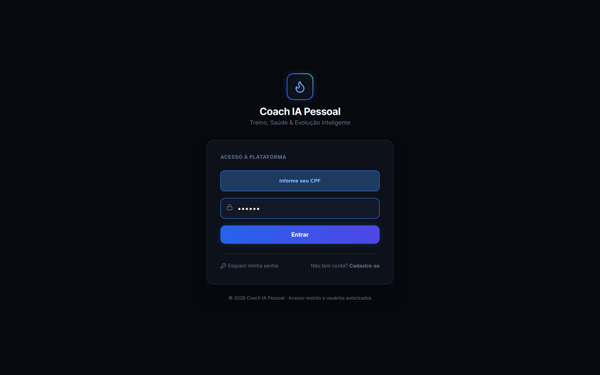

---

## Navegação

O aplicativo tem dois modos de navegação:

**No computador (desktop):**
Um menu fixo aparece no lado esquerdo da tela com todas as abas listadas.

**No celular:**
Na parte inferior aparecem 4 abas principais: **Início**, **Treino**, **Coach IA** e **Dieta**. Para acessar as demais abas, toque em **Mais** no canto inferior direito.

---

## Aba 1 - Dashboard (Início)

**Para que serve:** É a tela que aparece quando você entra no aplicativo. Aqui você vê um resumo rápido de tudo que importa no seu dia.

O que aparece na tela:

**Saudação e resumo inteligente**
Na parte superior, o Coach IA mostra uma mensagem personalizada de acordo com o horário ("Bom dia", "Boa tarde" ou "Boa noite") e um resumo do seu dia, incluindo qualidade do sono, tendência de peso, treino recomendado e lembretes de suplementos.

Para ver o resumo completo, toque em "Ver Completo".

**Cartões com seus dados do dia**
- Peso atual e quanto falta para sua meta (toque para ir para a tela de Evolução)
- Água bebida no dia, com botões rápidos de +250 ml e +500 ml
- Calorias e proteínas consumidas (toque para ir para a tela de Alimentação)
- Saúde articular (toque para ir para a tela de Saúde)

**Treino de hoje**
Na parte de baixo, aparece o treino do dia com todos os exercícios listados. Toque em "Iniciar Treino" para abrir a aba de Treinos e começar sua sessão.

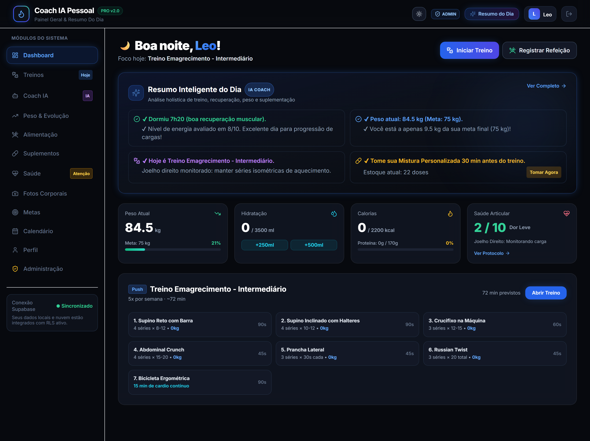

---

## Aba 2 - Treinos

**Para que serve:** Aqui você registra cada exercício, cada série e acompanha sua evolução de carga treino a treino.

**Como funciona a tela:**

No topo, aparecem abas com seus treinos (Treino 1, Treino 2...). Toque em cada uma para trocar de treino.

Abaixo, você vê um card grande com o nome do treino, a categoria (ex: Peito, Costas), duração estimada e quantos exercícios você já fez.

**Registrando um treino:**

1. Cada exercício aparece como um card separado.
2. Dentro de cada exercício, aparecem as séries (Série 1, Série 2, Série 3...).
3. Para marcar uma série como feita, toque nela. O cronômetro de descanso começa automaticamente.
4. Quando todas as séries de um exercício estiverem feitas, aparece uma confete de celebração e o exercício é marcado como finalizado.
5. No final do treino, toque em "Finalizar Treino" para salvar seus dados.

**Alterando a carga de um exercício:**
- Toque no ícone de lápis ao lado do peso. Digite o novo peso e salve.
- Use "Aplicar em todas" para colocar o mesmo peso em todas as séries daquele exercício.

**Exercício de cardio (esteira, bicicleta...):**
- Em vez de repetições, aparece um modo de tempo.
- Toque em "Iniciar" para começar a contar o tempo.
- Quando terminar, toque em "Cardio Concluído".

**Assistindo ao vídeo de um exercício:**
- Toque em "Ver Vídeo" para ver como o exercício é feito. O vídeo abre em uma janela sobreposta.

**Pedindo ajuste à IA:**
- Se o treino estiver muito pesado ou você quiser trocar algum exercício, toque em "Pedir Ajuste à IA". Você será redirecionado ao Coach IA com uma mensagem pronta para enviar.

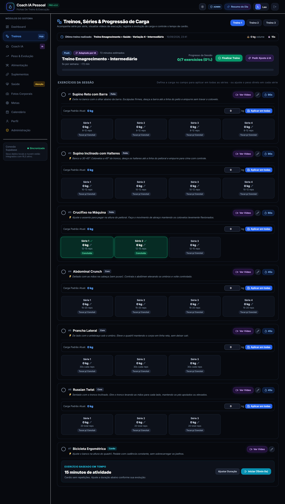

---

## Aba 3 - Coach IA

**Para que serve:** É o seu assistente inteligente disponível 24 horas por dia. Você pode conversar livremente com ele, pedir para criar treinos ou ajustar o treino atual.

**Tela inicial do Coach:**
Quando você entra na aba, o Coach IA pergunta o que você deseja fazer. Três opções aparecem:

- **Criar Treino:** Abre um passo a passo de 5 etapas onde você escolhe seus objetivos, limitações, dias da semana, duração e quantidade de treinos. No final, o Coach gera os treinos completos para você.
- **Ajustar Treino:** Envia uma mensagem ao Coach dizendo o que quer mudar (ex: "trocar agachamento por leg press porque meu joelho está doendo").
- **Melhorar Treino:** Envia uma mensagem ao Coach pedindo melhorias no treino atual.

**Conversando com o Coach:**
- Na parte de baixo da tela, há um campo de texto. Digite sua mensagem e toque em "Enviar".
- O Coach responde na hora. Você pode fazer perguntas como:
  - "Hoje estou sem energia"
  - "Meu joelho está doendo"
  - "O treino foi muito pesado"
  - "Dormi apenas 5 horas"

> O Coach IA leva em conta suas lesões, histórico e objetivos ao responder.

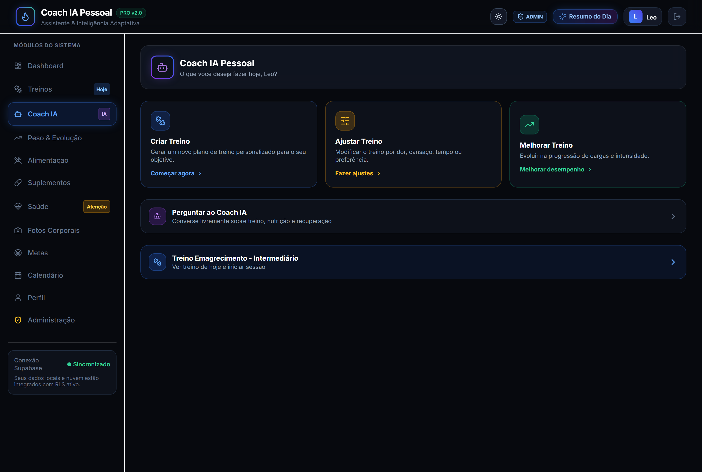

---

## Aba 4 - Alimentação (Dieta)

**Para que serve:** Registar o que você comeu durante o dia e acompanhar se está batendo suas metas de calorias, proteínas, carboidratos e gorduras.

**O que aparece na tela:**

Na parte superior, quatro cartões mostram seus totais do dia: Calorias, Proteínas, Carboidratos e Gorduras. Cada um mostra quanto você já comeu vs. quanto era a meta.

Abaixo, a barra de água com botões rápidos de +250 ml e +500 ml.

Na parte de baixo, a lista de refeições que você já registrou no dia.

**Registrando uma refeição:**
1. Toque em "Registrar Refeição".
2. Escolha o tipo (Café da Manhã, Almoço, Jantar, Lanche, Pré-Treino ou Pós-Treino).
3. Digite um título para a refeição (ex: "Arroz com frango e salada").
4. Informe as calorias, proteínas, carboidratos e gorduras (se souber).
5. Salve.

> Não sabe os valores nutricionais? Não tem problema. Coloque pelo menos o título e as calorias. Com o tempo você melhora esse registro.

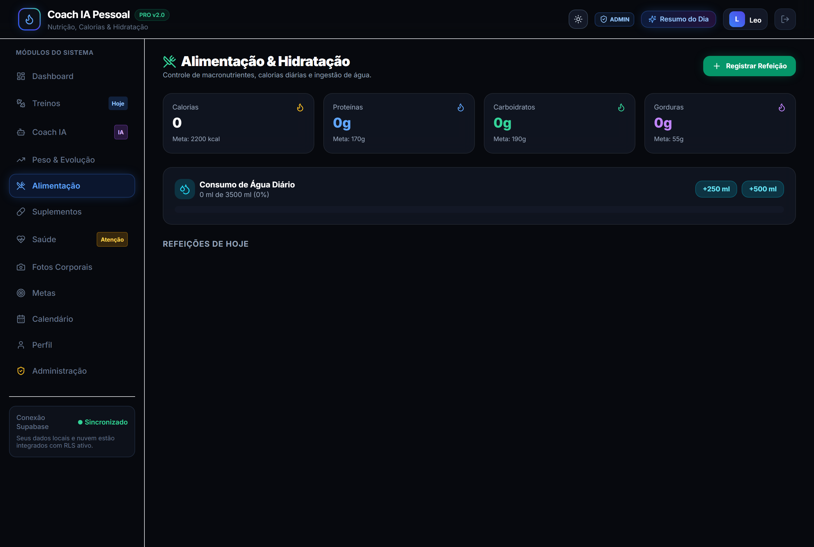

---

## Aba 5 - Peso e Evolução

**Para que serve:** Acompanhar sua evolução de peso, composição corporal e medidas ao longo do tempo.

**O que aparece na tela:**

Quatro cartões no topo mostram seu peso atual, IMC, percentual de gordura e massa muscular.

Abaixo, um gráfico com duas linhas: uma mostrando a evolução do peso e outra da massa muscular ao longo dos dias.

Mais abaixo, um histórico em tabela com todas as pesagens que você já registrou.

**Registrando uma nova pesagem:**
1. Toque em "Registrar Nova Pesagem".
2. Informe o peso (obrigatório) e, se quiser, o percentual de gordura, massa muscular, cintura, braço e coxa.
3. Salve. O IMC é calculado automaticamente.

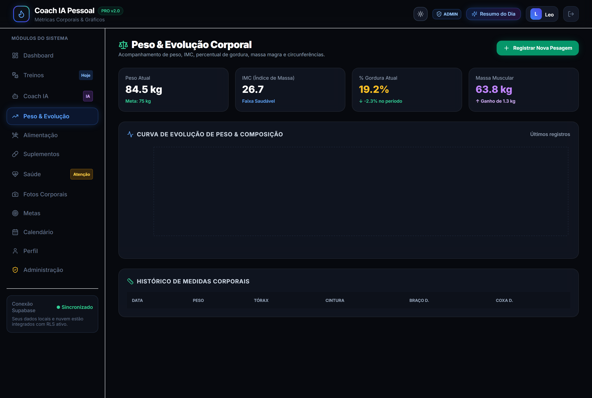

---

## Aba 6 - Suplementos

**Para que serve:** Controlar seus suplementos, estoque e lembres de quando tomar.

**O que aparece na tela:**

Na parte superior, um card destacado com sua **Mistura Personalizada** (fórmula manipulada). Nele aparece:
- A receita completa (ex: Creatina 5g + Beta-Alanina 3g + L-Citrulina 6g...)
- O estoque atual em doses
- Se o estoque está seguro ou baixo (avisos em verde ou vermelho)
- Um botão "Registrar Dose Ingerida" para descontar uma dose

Abaixo, uma grade com todos os outros suplementos (Vitaminas, Creatina, Whey, Omega 3...), cada um com seu estoque e botão "Tomar Dose".

**Adicionando um novo suplemento:**
1. Toque em "Novo Suplemento".
2. Preencha o nome, dosagem, horário recomendado e estoque inicial.
3. Se for uma mistura personalizada, marque a caixa "É a Mistura Personalizada exclusiva?".

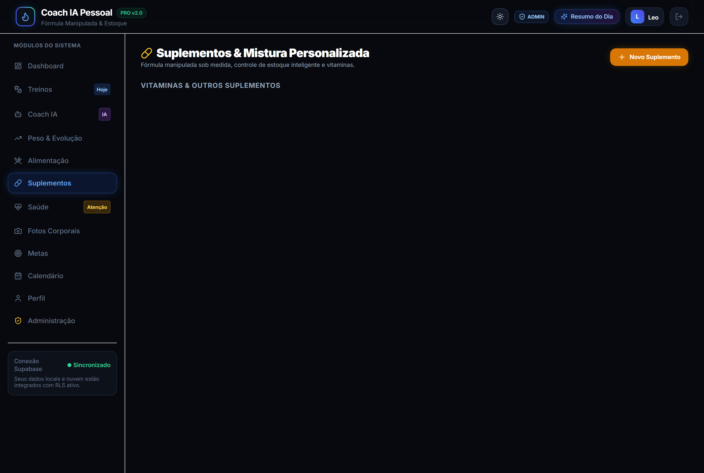

---

## Aba 7 - Saúde

**Para que serve:** Monitorar dores, lesões (como o joelho direito) e sinais vitais.

**O que aparece na tela:**

Na parte superior, um card destacado com o monitoramento de lesão ativa (por exemplo, joelho direito). Nele aparece:
- Um controle deslizante (barra) de 0 a 10 para você informar o nível de dor no dia
- Lista de exercícios que você NÃO deve fazer (restrições)
- Lista de exercícios seguros para fortalecer a região
- Observações de tratamento

Abaixo, cartões com sinais vitais: pressão arterial, glicemia e frequência cardíaca.

**Registrando uma nova lesão ou dor:**
1. Toque em "Registrar Lesão / Dor".
2. Informe a parte do corpo, o nível de dor (com a barra deslizante), os sintomas e observações.
3. Salve. A lesão será monitorada na tela.

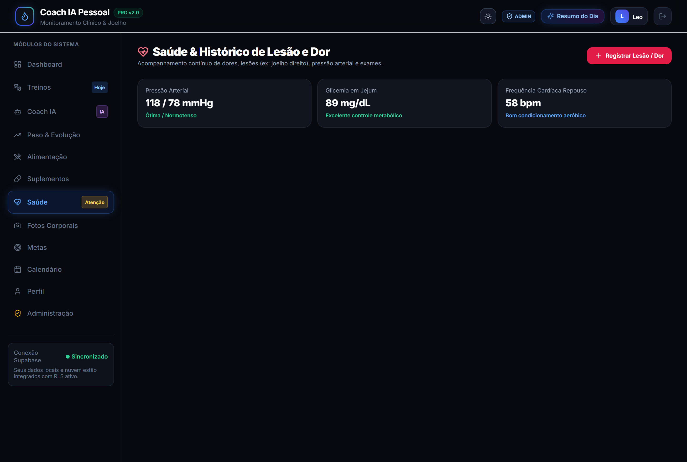

---

## Aba 8 - Fotos Corporais

**Para que serve:** Registrar fotos do seu corpo e comparar a evolução visual ao longo do tempo.

**Como funciona:**

No topo, três abas permitem escolher o ângulo: **Frente**, **Lado** ou **Costas**.

Abaixo, um comparador lado a lado mostra a foto inicial (Antes) e a foto atual (Depois), com datas e pesos.

Na parte de baixo, a galeria com todas as fotos registradas naquele ângulo.

**Registrando uma nova foto:**
1. Toque em "Nova Foto".
2. Cole o endereço (URL) da imagem, informe o peso daquele dia e, se quiser, uma observação.
3. Salve.

**Comparando fotos:**
- Toque em qualquer foto da galeria para defini-la como foto de comparação (Depois).

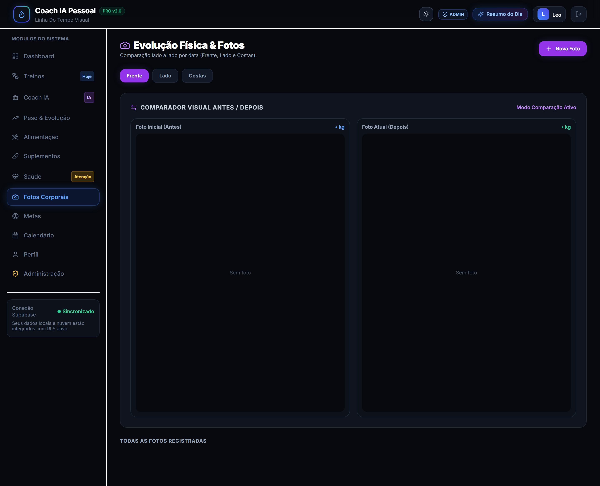

---

## Aba 9 - Metas

**Para que serve:** Criar e acompanhar metas pessoais como peso, frequência de treinos, água, sono e passos.

**O que aparece na tela:**

Uma grade de cartões, cada um com uma meta. Cada cartão mostra:
- O nome da meta
- O valor atual vs. a meta
- Uma barra de progresso com a porcentagem concluída
- Prazo (se definido)

**Criando uma nova meta:**
1. Toque em "Nova Meta".
2. Preencha o título, escolha a categoria (Peso, Treinos/Semana, Água, Sono, Passos ou Nutrição), informe a unidade, o valor atual e o valor-alvo.
3. Salve.

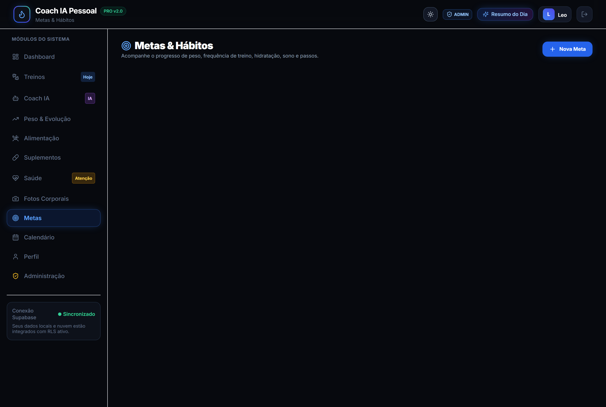

---

## Aba 10 - Calendário

**Para que serve:** Visualizar em um calendário mensal seus treinos, pesagens e dias de adherence à dieta.

**O que aparece:**

Um calendário do mês com pontos coloridos:
- **Azul:** Treino concluído naquele dia
- **Verde:** Pesagem registrada
- **Roxo:** Dieta 100% no plano

O dia atual aparece destacado com o rótulo "HOJE".

> Esta tela é apenas visual. Os dados são registrados automaticamente quando você registra treinos, pesagens e refeições nas outras abas.

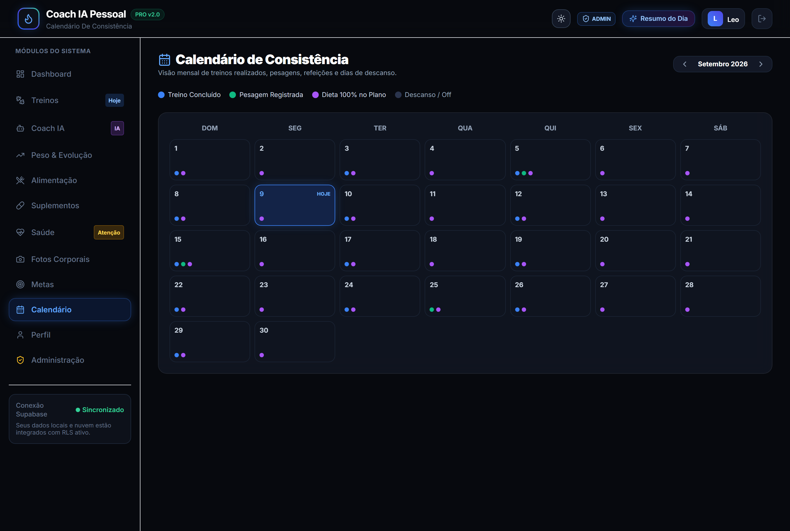

---

## Aba 11 - Perfil

**Para que serve:** Gerenciar seus dados pessoais e metas individuais de treino, alimentação e saúde.

**O que aparece na tela:**

As configurações do seu perfil: nome, apelido, e-mail, telefone, idade, altura, peso, academia, horário habitual de treino e meta diária de água.

**Editar perfil (autonomia total):**
1. Toque em **Editar** no topo da aba.
2. Altere os campos desejados (nome, apelido, e-mail, telefone, idade, altura, peso atual/objetivo, academia, horário habitual, meta de água).
3. Toque em **Salvar Alterações**. As mudanças passam a valer imediatamente nos seus próximos cálculos e são sincronizadas com o Supabase.

> Cada pessoa utiliza o app com seu **próprio login** (CPF + senha). Não é necessário criar membros dentro do app.

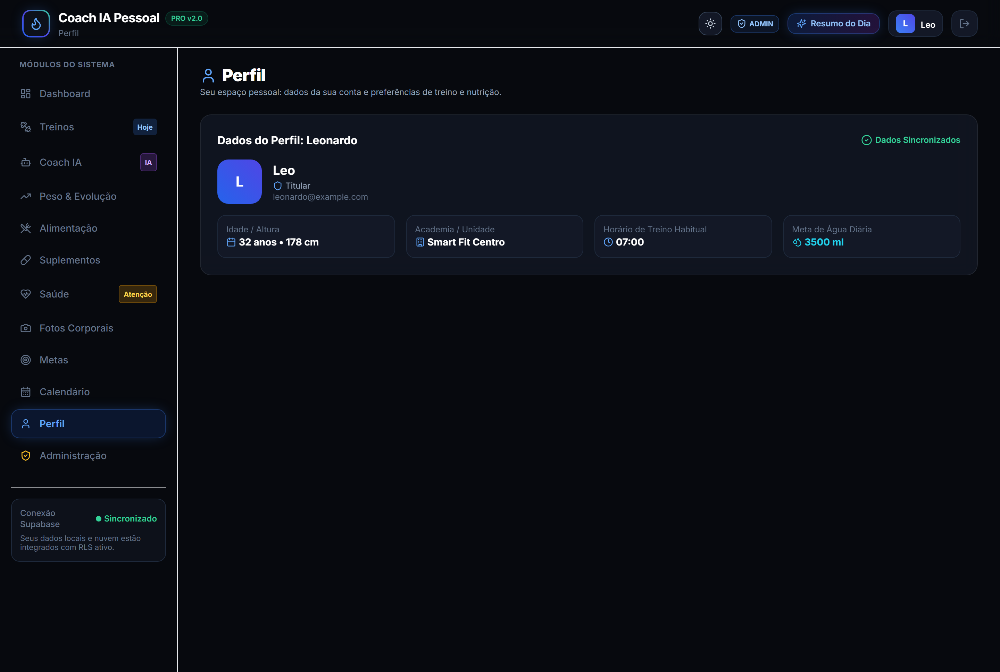

---

## Resumo rápido por aba

| Aba | O que você faz |
|-----|----------------|
| Dashboard | Vê o resumo do dia e começa o treino |
| Treinos | Registra exercícios, séries e cargas |
| Coach IA | Conversa com o assistente e pede ajustes |
| Alimentação | Registra refeições e água |
| Peso e Evolução | Registra pesagem e vê o gráfico |
| Suplementos | Registra doses e controla estoque |
| Saúde | Registra dores e acompanha lesões |
| Fotos Corporais | Compara fotos antes e depois |
| Metas | Cria e acompanha metas pessoais |
| Calendário | Vê os dias de consistência no mês |
| Perfil | Edita seus dados pessoais, metas e preferências |

---

## Dicas para o dia a dia

1. **Abra o app pela manhã** e confira o resumo inteligente para alinhar seu dia.
2. **Durante o treino**, marque cada série no app. O cronômetro de descanso cuida do tempo.
3. **Registre suas refeições** ao longo do dia para acompanhar as calorias e proteínas.
4. **Registre sua pesagem** uma vez por semana no mesmo dia e horário.
5. **Se algo não está funcionando**, converse com o Coach IA. Ele conhece seu histórico e pode ajustar tudo para você.
